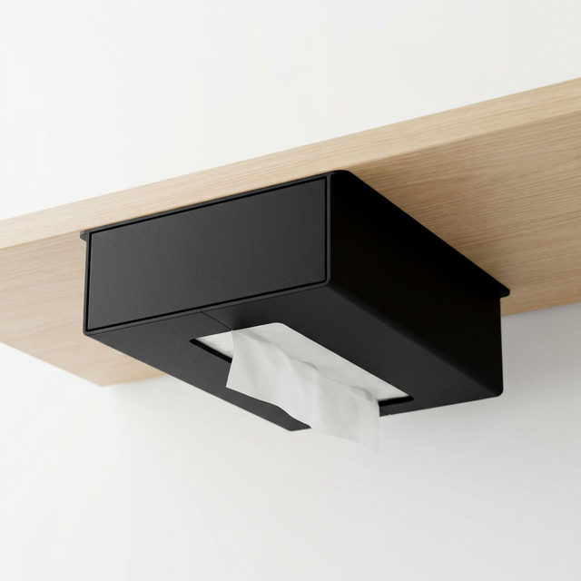

# Under-Shelf Tissue Holder

棚の底面にソフトパックティッシュを固定する一体型ティッシュホルダーです。
Bambu Lab P2Sなどの最新3Dプリンターで、最適に素早く・強力に印刷できるように設計されています。

## 特徴

- **サポート材不要**: 前面をビルドプレートに密着させる（横に倒して高く積層する）向きで印刷できるように設計しているため、サポートなしで美しく出力可能です。
- **ソリッドで美しいデザイン**: 奥行き側に長辺を配置し、前面はフラットでマットなソリッド箱型になるため、どんな棚にもすっきりと馴染みます。
- **ティッシュの入れ替え**: 背面からスライドして装填する仕組みです。（必要に応じて棚板から少し手前に引き出して交換）
- **高い強度**: 入隅にはフィレットではなくウェッジ（斜めの柱）を追加することで確実な強度を持たせています。

詳細はCadQueryスクリプト内のドキュメントや `history.md` をご覧ください。
